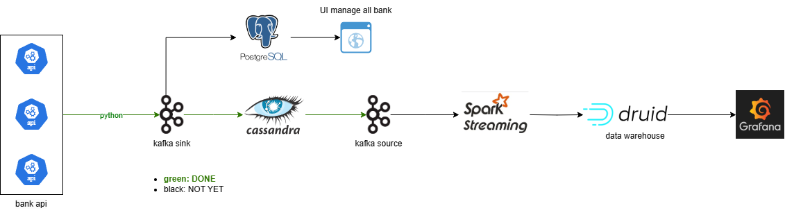

# Exchange Rate Crawler and Analysis

## Description
This project extracts the exchange rate from 5 Vietnamese banks and attempts to achieve near real-time exchange rate monitoring and analysis

## Architecture

## Features
This project is a work in progress. Current state:
- Implemented:
    - [x] Scheduled an ETL Python script to extract the exchange rate every 5 seconds and stored in a Kafka topic as a centralized storage for all bank
    - [x] Handle CDC
    - [x] Schedule an ETL script for extracting historical data
- Planned:
    - [ ] Configured the Kafka sink connector to continuously sink the crawled exchange rate to Cassandra
    - [ ] Configured the Kafka source connector to continuously pull new exchange rates to Spark Streaming and saved to the Druid as the data warehouse
    - [ ] Build the Grafana dashboard to monitor and aggregate the exchange rates as soon as they are arrived in Druid

